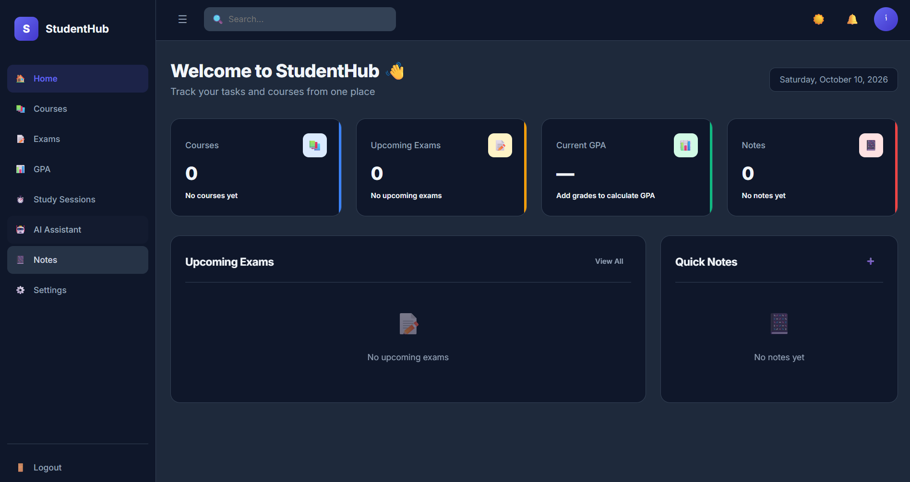
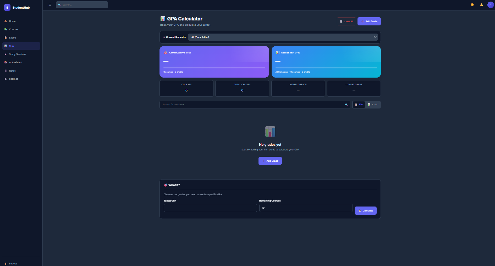
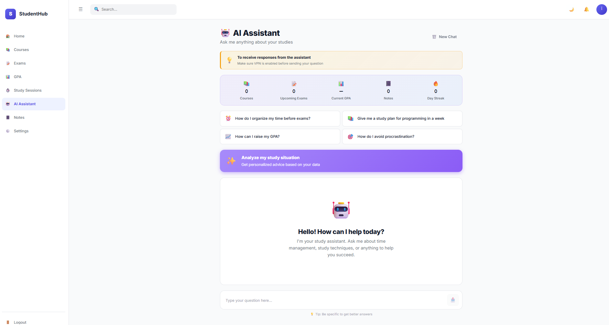

# 🎓 StudentHub

<div align="center">


</div>

A comprehensive university student platform built entirely with **Vanilla JavaScript** — **No frameworks, no libraries, no dependencies!** It brings all the tools a student needs into one beautiful, modern interface: courses management, exams tracking, GPA calculator, Pomodoro timer, notes, and an AI study assistant.

## ✨ Features

- 📚 **Courses Management** — Organize courses with professor, room, schedule, and credits
- 📝 **Exams Tracker** — Live countdown timers with urgency indicators
- 📊 **GPA Calculator** — Cumulative & semester GPA with charts and What-If scenarios
- ⏱️ **Pomodoro Timer** — 4 study modes with cross-page persistence
- 📔 **Smart Notes** — Color-coded, searchable, pinnable notes with tags
- 🤖 **AI Assistant** — Personalized study advice based on your data
- 🔔 **Notifications** — Smart reminders for exams and tasks
- 🌙 **Dark / Light Mode** — Saved in LocalStorage
- 🌍 **Multi-Language** — Full Arabic (RTL) & English (LTR) support
- 📱 **PWA** — Install as a native app on any device
- 🔌 **Offline Support** — Works offline with Service Worker
- 💾 **Local Storage** — All data stays in the browser (100% private)
- ⚠️ **VPN Notice** — Smart hint for AI assistant in restricted regions

## 🛠️ Tech Stack

| Technology | Purpose |
| :--- | :--- |
| **HTML5** | Semantic structure |
| **CSS3** | Custom Properties, Grid, Flexbox, Animations |
| **JavaScript (Vanilla)** | Logic, DOM, ES6 Modules, Async/Await |
| **Service Worker** | Offline support & caching |
| **Web App Manifest** | PWA installability |
| **Cloudflare Workers** | AI API proxy |
| **LocalStorage** | Client-side data persistence |

> 💡 **Zero Dependencies** — This project uses **NO** npm packages, **NO** frameworks (React/Vue/Angular), **NO** CSS libraries (Bootstrap/Tailwind). Just pure HTML, CSS, and JavaScript!

## 📂 Project Structure

```text
studenthub/
├── assets/
│   └── icons/              # PWA icons
├── css/
│   ├── base/               # Reset, variables, typography
│   ├── components/         # Buttons, cards, forms, dialogs
│   ├── layout/             # Grid, sidebar, header
│   └── pages/              # Page-specific styles
├── js/
│   ├── core/               # Notifications engine
│   ├── i18n/               # Arabic & English translations
│   ├── modules/            # Page logic
│   ├── utils/              # Shared utilities
│   └── main.js             # Entry point
├── index.html              # Dashboard
├── courses.html            # Courses page
├── exams.html              # Exams page
├── gpa.html                # GPA calculator
├── timer.html              # Pomodoro timer
├── ai.html                 # AI assistant
├── notes.html              # Notes page
├── settings.html           # Settings
├── manifest.json           # PWA manifest
└── service-worker.js       # PWA service worker
```

## 🚀 How to Run

1. Clone the repository:

   ```bash
   git clone https://github.com/ali-alfozo/studenthub.git
   ```

2. Open the folder in VS Code.

3. Right-click on `index.html` → **Open with Live Server**.

> ⚠️ **Note:** Must use a local server (Live Server) — ES Modules don't work with `file://`.

## 📱 PWA Installation

1. Open the site in Chrome/Edge.
2. Click the **Install** icon (📲) in the address bar.
3. Access it from your home screen.

## 🌐 Live Demo

Experience the application directly in your browser:

🔗 [https://ali-alfozo.github.io/studenthub/](https://ali-alfozo.github.io/studenthub/)

> 💡 **Note for AI Assistant:** In some regions (e.g., Syria), please enable **VPN** before using the AI assistant.

## 📚 What I Learned

- 🏗️ **Modular Architecture** — Clean separation of concerns with ES6 modules
- 🌍 **i18n System** — Full RTL/LTR support with dynamic language switching
- ⏱️ **State Persistence** — Cross-page Timer using `localStorage` + `endTime`
- 🔔 **Web Notifications API** — System notifications from any page
- 📱 **PWA** — Service Worker caching + installable app
- 🤖 **AI Integration** — Cloudflare Workers as API proxy
- 🎨 **Design System** — CSS custom properties for consistent theming
- 📊 **Data Visualization** — SVG charts without libraries
- 🔄 **Cross-page Sync** — `CustomEvent` + `storage` events
- 🛡️ **CORS Handling** — Working with ES Modules + Service Workers

## 📸 Screenshots

### 🏠 Dashboard


### 📊 GPA Calculator


### 🤖 AI Assistant


## 👨‍💻 Author

**Ali Alfozo**

- GitHub: [@ali-alfozo](https://github.com/ali-alfozo)
- LinkedIn: [Ali Alfozo](https://www.linkedin.com/in/ali-alfozo-834412400)

---

⭐ **If you like this project, give it a star!**
